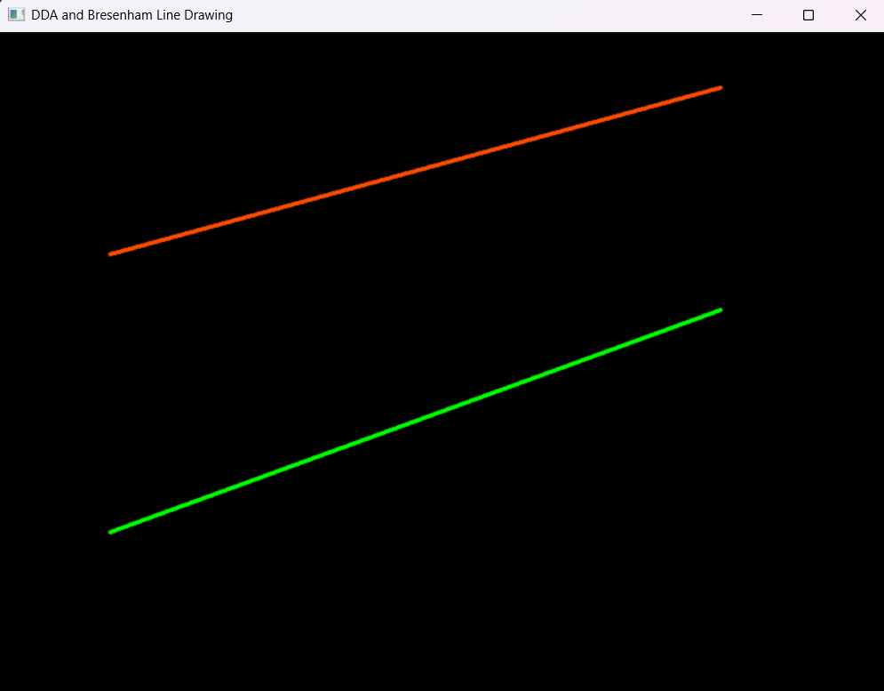
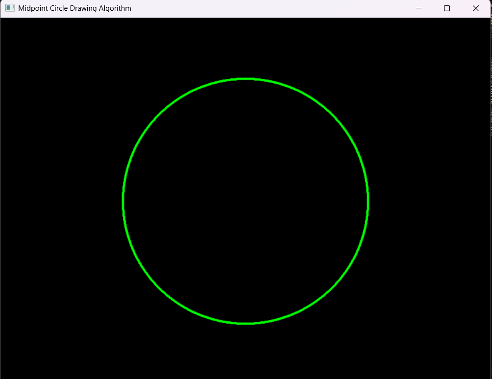
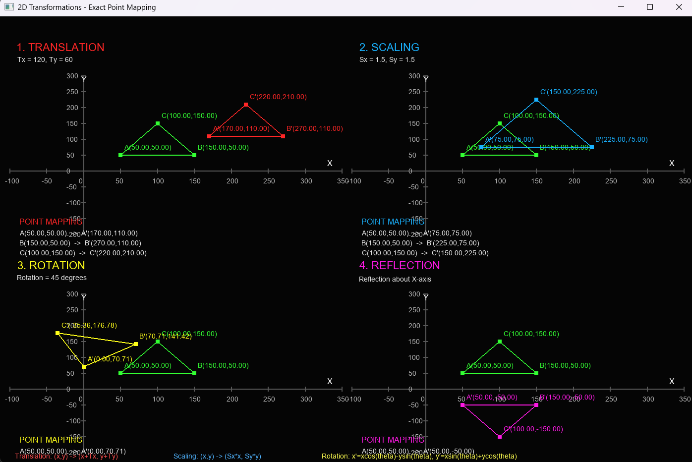
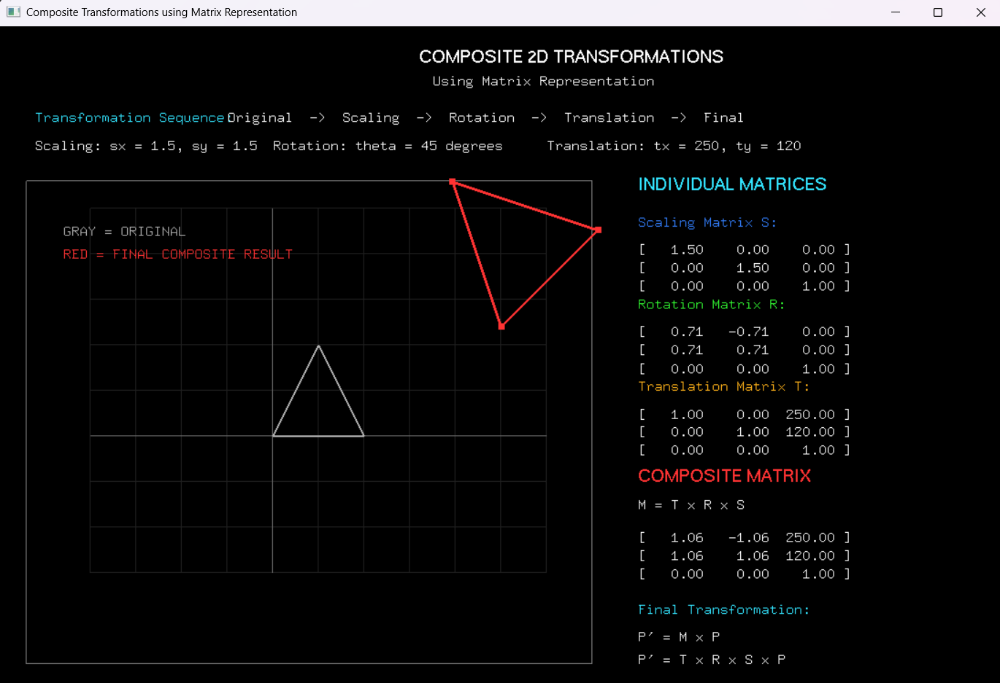
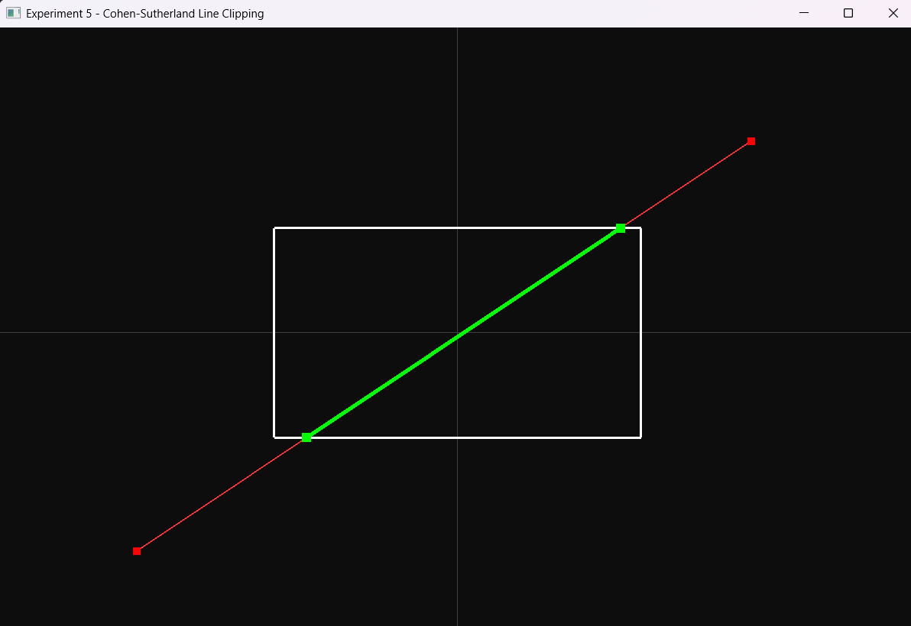

# Computer Graphics and Virtual Reality

**SHREYAS C**  
**USN: 1RVU23CSE443**

## List of Laboratory Programs

| Sl. No. | Laboratory Experiment |
|--------:|------------------------|
| 1 | Implement DDA and Bresenham line drawing algorithms |
| 2 | Implement the Midpoint Circle Drawing Algorithm |
| 3 | Implement 2D transformations (translation, rotation, scaling, reflection and shearing) using homogeneous coordinates |
| 4 | Implement composite transformations using matrix representation |
| 5 | Implement the Cohen–Sutherland line clipping algorithm |
| 6 | Implement the Z-buffer algorithm for hidden surface removal |
| 7 | Implement the Phong illumination model for a 3D object |
| 8 | Develop a basic OpenGL program using vertex and fragment shaders |
| 9 | Create a simple interactive 3D scene using Unity |
| 10 | Implement the 3D viewing pipeline, including projection and viewport mapping for displaying 3D objects on a 2D screen |

---

# Experiments

## Experiment 1: DDA and Bresenham's Line Drawing Algorithms

Implementation of the DDA (Digital Differential Analyzer) and Bresenham's line drawing algorithms using OpenGL and GLFW.

**Program:**

- `CG-LAB1-443.py`

**Output:**



---

## Experiment 2: Midpoint Circle Drawing Algorithm

Implementation of the Midpoint Circle Drawing Algorithm using OpenGL and GLFW.

**Program:**

- `CG-LAB2-443.py`

**Output:**



---

## Experiment 3: 2D Transformations Using Homogeneous Coordinates

Implementation of basic 2D transformations using homogeneous coordinate representation.

The transformations include:

- Translation
- Rotation
- Scaling
- Reflection
- Shearing

**Program:**

- `CD-LAB3-443.py`

The program demonstrates how transformation matrices can be applied to 2D objects.

**Output:**



---

## Experiment 4: Composite Transformations

Implementation of composite 2D transformations using matrix representation.

Multiple transformations are combined and applied to graphical objects using transformation matrices.

**Program:**

- `CD-LAB4-443.py`

  **Output:**



---

## Experiment 5: Cohen–Sutherland Line Clipping

Implementation of the Cohen–Sutherland line clipping algorithm.

The algorithm uses region codes to determine whether a line lies:

- Completely inside the clipping window
- Completely outside the clipping window
- Partially inside the clipping window

**Output:**



**Program:**

- `CGVR-LAB5-443.py`

---

## Experiment 6: Z-Buffer Algorithm

Implementation of the Z-buffer algorithm for hidden surface removal.

The Z-buffer algorithm determines which surface is visible at each pixel by comparing the depth values of different surfaces.

**Program:**

- `CD-LAB6-443.py`

---

## Experiment 7: Phong Illumination Model

Implementation of the Phong illumination model for a 3D object.

The Phong model considers three components of illumination:

- Ambient reflection
- Diffuse reflection
- Specular reflection

The model is used to produce realistic lighting effects on 3D objects.

**Program:**

- `CD-LAB7-443.py`

---

## Experiment 8: OpenGL Vertex and Fragment Shaders

Development of a basic OpenGL program using vertex and fragment shaders.

The experiment demonstrates the programmable graphics pipeline using:

- Vertex shaders
- Fragment shaders
- OpenGL rendering

**Program:**

- `CD-LAB8-443.py`

**Output:**


---

## Experiment 9: Interactive 3D Scene Using Unity

Creation of a simple interactive 3D scene using Unity.

The experiment demonstrates basic 3D scene creation, object manipulation, camera setup and interaction.

**Output:**


---

## Experiment 10: 3D Viewing Pipeline

Implementation of the 3D viewing pipeline for displaying 3D objects on a 2D screen.

The experiment covers:

- 3D projection
- View transformation
- Projection transformation
- Viewport mapping
- Display of 3D objects on a 2D screen

**Program:**

- `CD-LAB10-443.py`

---

# Technologies Used

- Python
- OpenGL
- GLFW
- Unity
- Computer Graphics Algorithms
- Homogeneous Transformation Matrices
- Shader Programming

# Repository Structure

```text
computer-graphics-and-virtual-reality/
│
├── CG-LAB1-443.py
├── CG-LAB1-443.png
│
├── CG-LAB2-443.py
├── CG-LAB2-443.png
│
├── CD-LAB3-443.py
│
├── CD-LAB4-443.py
│
├── CGVR-LAB5-443.py
├── CGVR-LAB5.png
│
├── CD-LAB6-443.py
│
├── CD-LAB7-443.py
│
├── CD-LAB8-443.py
├── CGVR-LAB8.png
│
├── CGVR-LAB4.png
│
├── CD-LAB10-443.py
│
└── README.md
